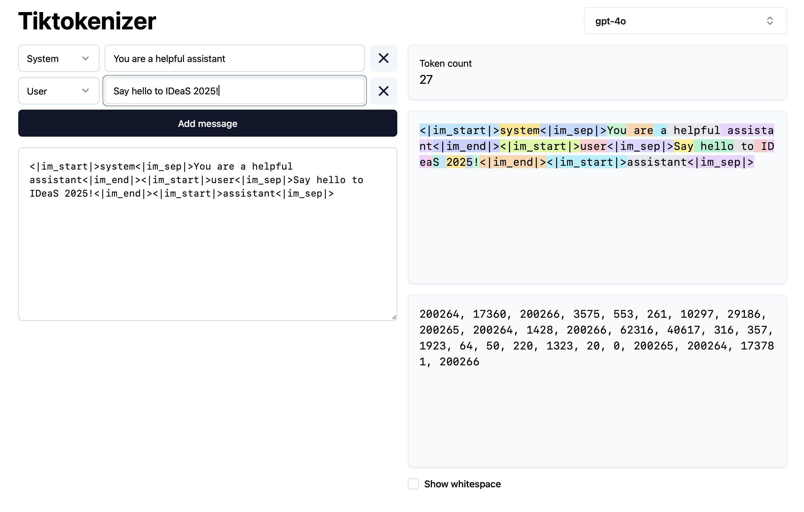
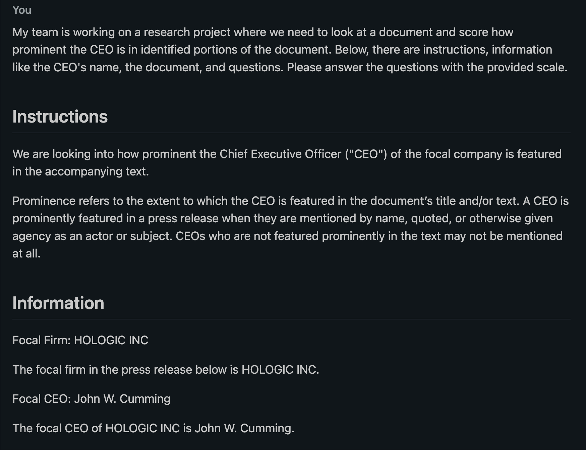
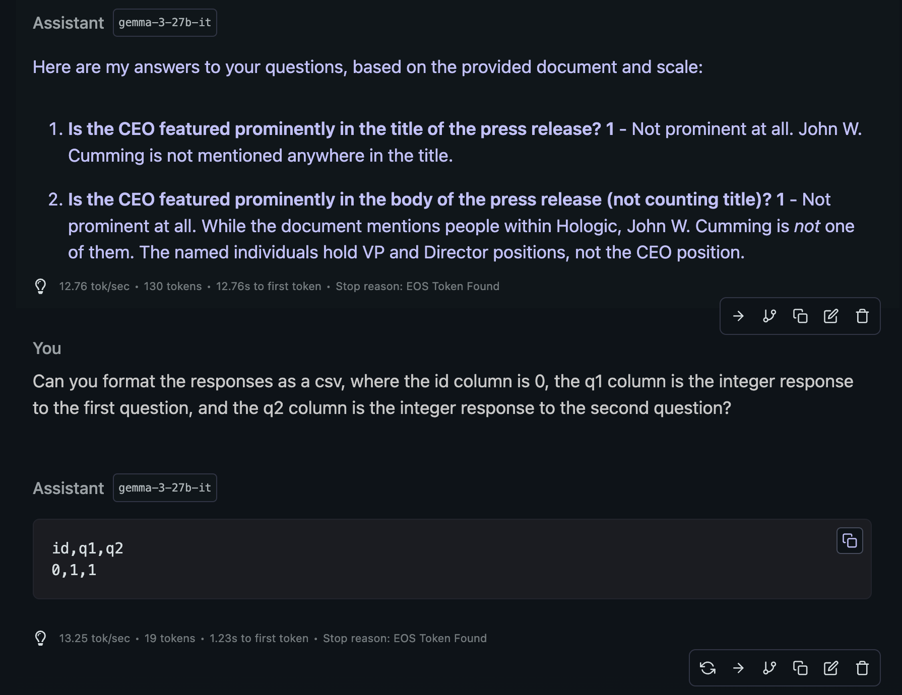
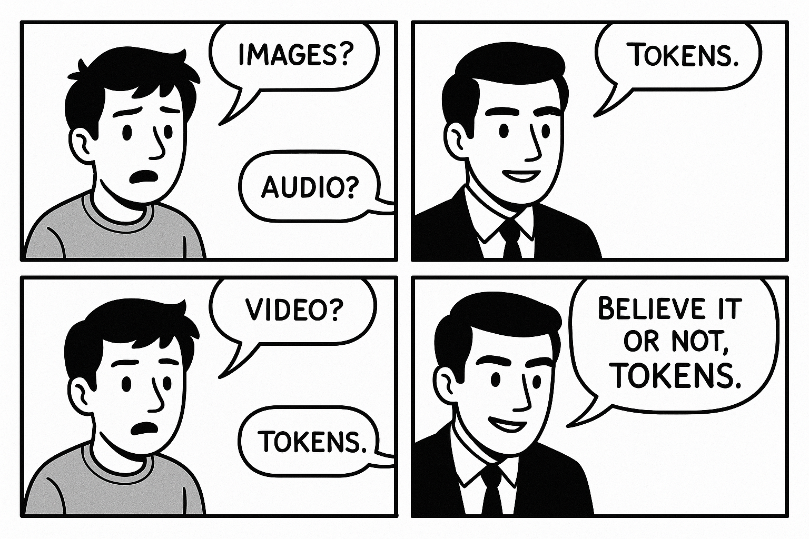

# Overview

## Abstract {visibility="hidden"}

I introduce large language models (LLMs) by unpacking what they are, how they work, and why they matter for business researchers.
Then, I turn to local LLMs—models you can run on your own machine—highlighting their advantages in privacy, cost, and flexibility.
To encourage action, I walk through how to get started.
I argue that local LLMs empower researchers to experiment, prototype, and explore ideas—without relying solely on commercial platforms.


## Evocative terms

We hear a lot of human-like terms used to describe LLMs:

::: {.r-stack}

::: {.columns}
::: {.column width="50%"}
- Intelligent
- Creative
- Reasoning
:::
::: {.column width="50%"}
- Learning
- Knowing
- Hallucinating
:::
:::

::: {.fragment .r-fit-text .fade-up}
[Not really!]{style="color:red"}

:::
:::


## Questions

::: {.incremental}
- How do LLMs really work?
- Why are Local LLMs interesting?
- How do I get started with Local LLMs?
- Where is all of this headed?
:::


## My Approach

- **Moderately skeptical.** I've been through the tech hype cycle before.
- **Technical deep dive.** I went fairly deep into the technical details of LLMs.
- **Guest-edited papers for ORM.** We have some interesting submissions using LLMs for our feature topic.


## My Usage

- Much experimentation, from GUI tools to integrated LLM applications.
- Prototyped tools in Python that search custom data and code measures.
- Wrote a story for my four-year-old daughter.
- Vibe-coded a usable start to a web app with new-to-me framework.
- A lot of iteration for this presentation.


## Hype Train


::: {.footer}
[ChatGPT Prompt and Response](https://chatgpt.com/share/680e703c-8118-8003-bcb6-2b461626c711)
:::


# How do LLMs really work?


## LLM training

Big industry players train LLMs on massive datasets, over weeks or months.

| **Step**                  | **Description**                                                                 |
|---------------------------|---------------------------------------------------------------------------------|
| **Data Collection**       | Gather large-scale text data from diverse sources (e.g., books, websites).      |
| **Pre-training**           | Train the model on a self-supervised task (e.g., next-token prediction).        |
| **Fine-tuning**           | Adapt the pre-trained model to specific tasks or domains using labeled data.     |

::: {.notes}
- The output of pre-training is a **base model**, which is like an internet text simulator.
- Fine tuning is where the model is trained further on datasets like chat logs, and the result is an **instruct model**.
:::


::: footer
[Deep Dive into LLMs like ChatGPT](https://www.youtube.com/watch?v=7xTGNNLPyMI)
:::


## LLM use at a high level

::: {.columns}
::: {.column width="50%" .r-fit-text}

- Text is tokenized and embedded.
- Embeddings are fed into a neural network that predicts the next token.
- The predicted token is added to the input sequence, and the process repeats until a stopping condition is met.
- Along the way the model detokenizes the tokens and generates text, which is streamed to the user.

:::

::: {.column width="50%"}
```{=html}
<video width="100%" style="display: block; margin: 0 auto;" controls muted autoplay loop>
  <source src="_img/streaming.mov" type="video/mp4">
</video>
```
:::
:::


## Providing input to LLMs

The **context window** is the input to the model.

::: {.r-fit-text}

| **Component**            | **Description**                                                                 |
|--------------------------|---------------------------------------------------------------------------------|
| **System Prompt**        | A predefined instruction or configuration that guides the model's behavior.     |
| **User Prompt**          | The input provided by the user, such as a question, command, or text.           |
| **Model Output**         | Tokens generated by the model so far, appended to the input during inference.   |
| **Conversation History** | Previous exchanges (user inputs and model responses) to maintain context.       |
| **Special Tokens**       | Tokens used to separate or identify different parts of the input (e.g., `<|endoftext|>`). |

:::


## Tiktokenizer



::: footer
[tiktokenizer](https://tiktokenizer.vercel.app)
:::


# Why are Local LLMs interesting?

## Local LLMs: Advantages

- **Privacy.** Nothing leaves your machine.
- **Cost.** No need to pay for API calls or wait for account limits.
- **Customization.** Fine-tune the model on your own data.
- **Integration.** Easier to integrate with other local tools and workflows.


## Local LLMs: Trade-offs

- **Performance.** Local models are generally not as powerful as cloud-based ones.
- **Hardware Requirements.** Depending on what you have already, it may be expensive to buy hardware.
- **Technical Complexity.** Setting up custom workflows can be challenging.
- **Tools and Agents.** Cloud-based models often have built-in tools like web search that they can use automatically.


# How do I get started with Local LLMs? {background-image="_img/lmstudio.png" background-opacity="0.4"}

## Terms

- **Parameters.** The number of weights in the model. More parameters = more powerful.
- **Quantization.** Reducing the precision of the model's weights to save memory and improve performance.
- **GPU Offloading.** Using the GPU to speed up model inference.
- **Distillation.** A process to create a smaller, faster model from a larger one.
- **Instruct models.** The result of fine-tuning a base model to follow user instructions more effectively (i.e. be a chatbot).


## Starting easy

- **Use LM Studio.** It's a GUI tool that makes it easy to run LLMs locally.
- **Use a recommended model.** At the moment, Gemma 3 and QwQ are good choices.
- **Full offloading.** Choose a model that fits in your machine's memory. Look for 🚀.
- **Complement with cloud.** Use cloud-based model free account tiers for comparison.


## Going deeper {background-image="_img/hardware.png" background-opacity="0.6"}

::: {.columns .r-fit-text}
::: {.column width="50%"}

- **Hardware.**
    - **Apple Silicon Macs.** Start with what you have, and 36-64GB of RAM is the sweet spot.
    - **NVIDIA GPUs.** Performance is faster, but memory capacity above 16GB is very expensive.
- **Pair with cloud.** Paid cloud accounts are less expensive than hardware and pair nicely.

:::
::: {.column width="50%"}
- **Software.**
    - **[Agno](https://docs.agno.com/introduction).** Lightweight framework for building LLM applications.
    - **[Atomic Agents](https://docs.agno.com/introduction).** A more developer-oriented framework.
    - **[Unsloth](https://unsloth.ai).** Used for fine-tuning. Watch for hardware requirements.
- **Fast moving.** This space is changing rapidly, so explore widely before going too deep.
:::

:::

::: {.notes}
- The 27-32B parameter models are the sweet spot for most tasks.
- LM Studio supports AMD and Intel GPUs, too.
- There is a lot of movement in hardware, so keep an eye on the latest developments.
:::


## Usage advice

- **Start with the context window.** Give the LLM some data and ask it to do something.
- **Validate.** It's the same as any other process we give input to and receive output from.
- **Embrace randomness.** LLMs are not deterministic, so try multiple runs.
- **Try everything.** Build intuition for what works and what doesn't.


## Example

::: {.r-stack}


{.fragment}
:::


# Where is all of this headed?

## LLMs

- **Stable foundations.** Embeddings, pre-training, and standard fine-tuning are relatively well-settled.
- **Reinforcement learning.** Use reward system to improve model performance.
    - **Verifiable tasks.** For example, running code and mathematical correctness.
    - **Human feedback (RLHF).** Use human feedback to improve model performance, but it's limited in effect.
- **Tools and agents.** LLMs can be augmented with tools (e.g., web search) and agents that decompose tasks and use tools to accomplish them.


## Data types

::: {.columns}

::: {.column width="50%"}

- Images?
- Audio?
- Video?
- Believe it or not, tokens!

:::

::: {.column width="50%"}

[Not great. 😬]{.fragment style='display: flex; justify-content: center; align-items: center;'}

:::
:::

::: {.footer}
[ChatGPT Prompt and Responses](https://chatgpt.com/share/680e85ac-23e0-8003-936c-8412b3b85abf)
:::


## Key takeaways

- **Tokens.** It's all next tokens. The magic is that it works at all.
- **Local LLMs.** Private, performant, and priced right.
- **Capable and growing.** You can do a lot today with local LLMs, and advancements are rapid and significant.


# The End/Q&A {background-image="_img/title.png"}
